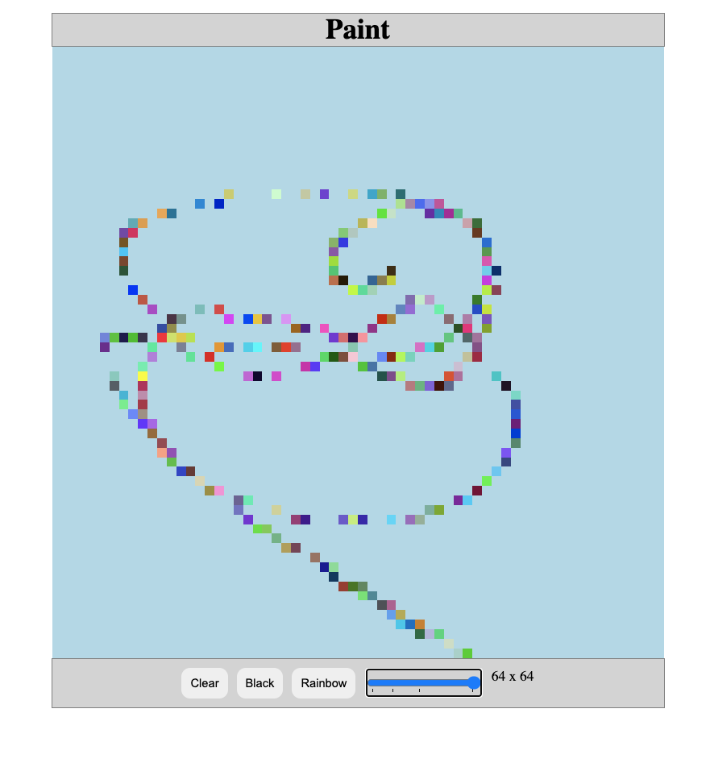

# etch-a-sketch-TOP

## About 
This was a project made for The Odin Project, especifically to learn about JavaScript and CSS. It simulates the popular toy Etch-a-sketch on a website.
- Ability to change the size of the grid, from 4x4 to 64x64
- Draw on black or random colors
- Clear the sketch with one button

  
  
